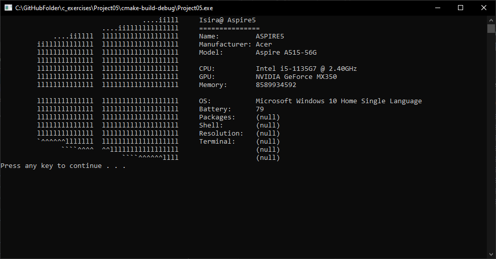

# Neofetch-like System Information Display

## Table of Contents

- [Overview](#overview)
- [Features](#features)
- [Technologies Used](#technologies-used)
- [Installation](#installation)
- [Screenshots](#screenshots)
- [Contributing](#contributing)
## Overview

Neofetch-like System Information Display is a command-line application that gathers and presents system information in a visually appealing ASCII art style. Inspired by Neofetch, this application provides users with an easy way to view key system details, making it useful for system administrators, enthusiasts, and anyone curious about their computer's configuration.

## Features

List the main features of your project. You can use bullet points or a numbered list.
- ASCII art representation of system information.
- Display of essential details like hostname, operating system, CPU, memory, and more.
- Customizable configuration for displaying specific information.
- Supports a variety of Windows system information retrieval methods.
- Simplified output suitable for a terminal display.

## Technologies Used

- C programming language
- Windows API
- Command-line interface
- ASCII art generation

## Installation

1. Clone this repository to your local machine.
2. Navigate to the project directory.
3. Compile the code using your preferred C compiler.
4. Run the executable to see the Neofetch-like system information display.

## Screenshots

## Contributing

Contributions to Neofetch-like System Information Display are welcome! If you'd like to contribute:

1. Fork the repository.
2. Create a new branch for your feature or bug fix.
3. Make your changes and commit them.
4. Open a pull request describing your changes.
